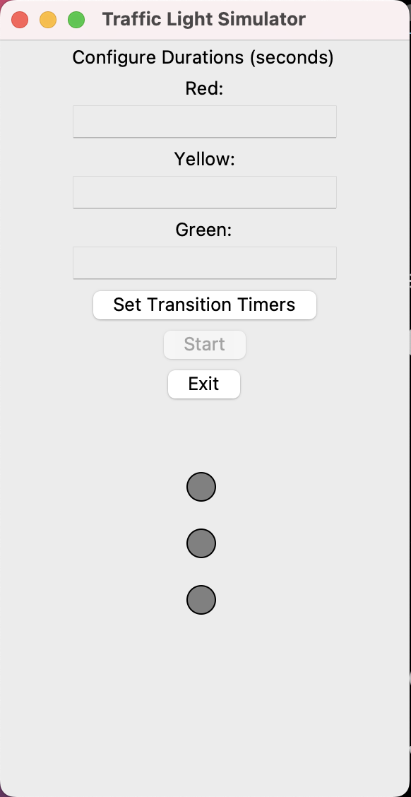

# Traffic Light Simulator

This is a simple traffic light simulator implemented in Python using the Tkinter library for the graphical user interface.

## Overview

The Traffic Light Simulator allows you to configure the durations of the red, yellow, and green lights on a traffic light and then simulate the traffic light transitions based on those durations. It provides a graphical representation of a traffic light, and you can set the timers for each light's duration.

## Features

- Set custom durations for the red, yellow, and green lights.
- Simulate traffic light transitions with the configured durations.
- User-friendly GUI for easy interaction.
- Requires Transition timer to be set before start
- Provides Exit feature to ask user, "Are you sure you want to exit the application?"

## Requirements

To run the Traffic Light Simulator, you need to have Python installed on your system. The code was developed using Python 3.x.

## How to Use

1. Clone this repository to your local machine:

```git clone https://github.com/gauwow/trafficlightsimulator.git```


2. Navigate to the project directory:

```cd trafficlightsimulator```


3. Run the Python script:

```python trafficlightsimulator.py```


4. The application window will open, allowing you to set the durations for the traffic light's red, yellow, and green lights.

5. Click the "Set Transition Timers" button to configure the timers.

6. Once the timers are set, click the "Start" button to begin the simulation.

7. To exit the application, click the "Exit" button.

## Screenshots



## Contributing

Contributions to this project are welcome! If you find any issues or have ideas for improvements, please open an issue or create a pull request.

## License

This project is licensed under the MIT License - see the [LICENSE](LICENSE) file for details.


